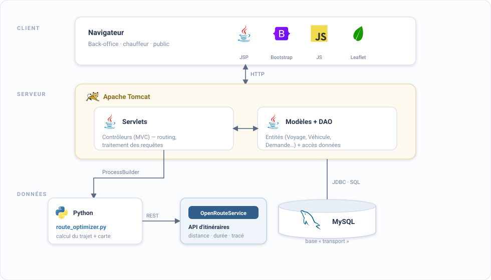
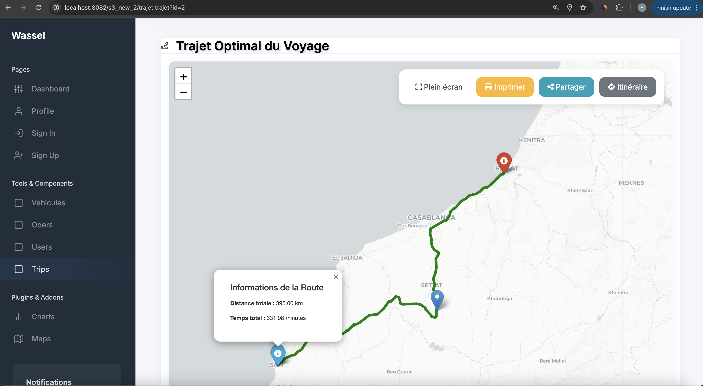
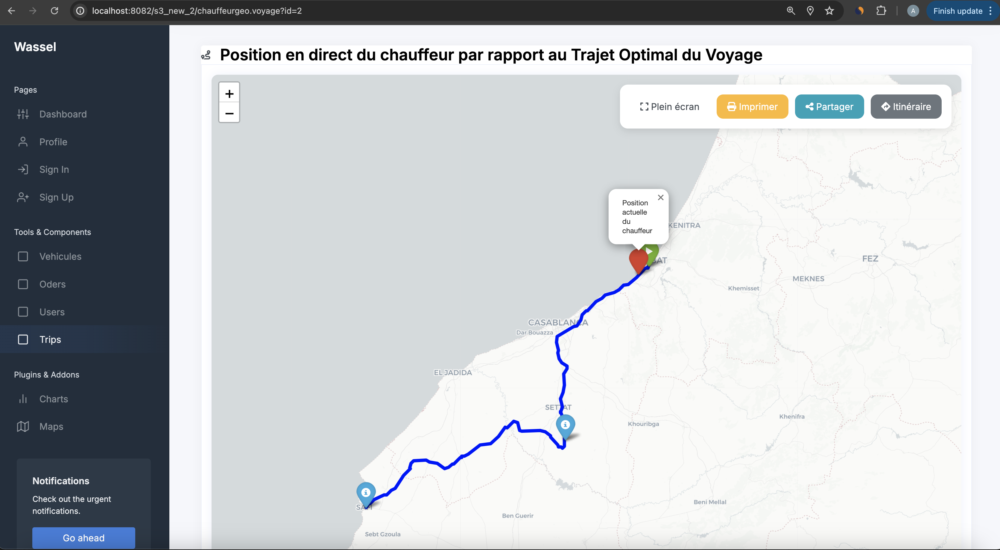
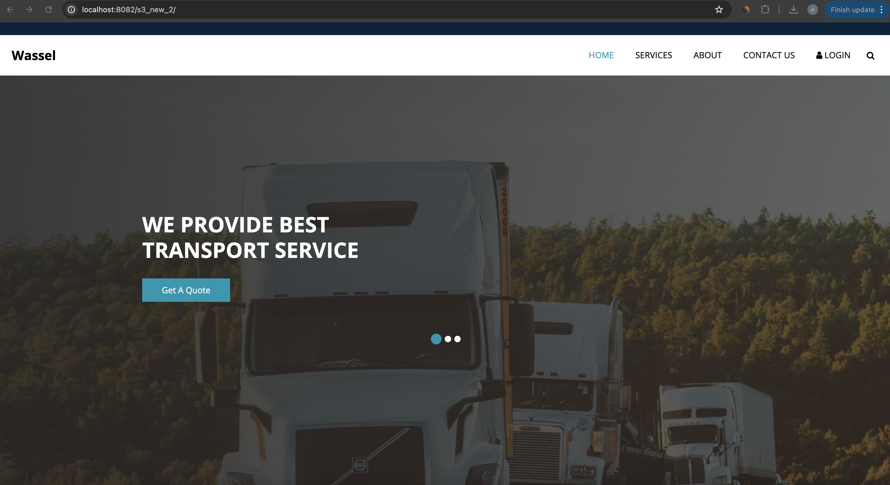
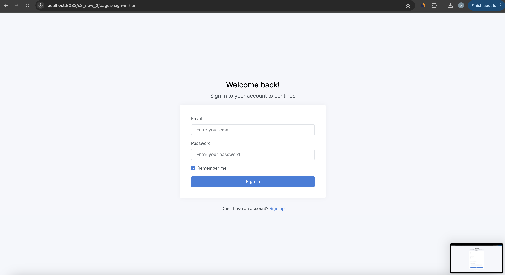
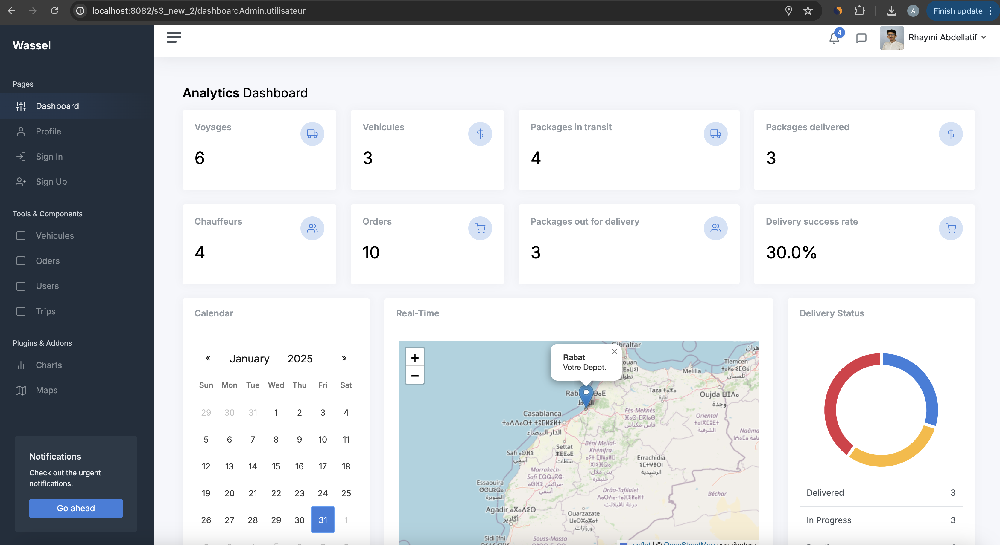
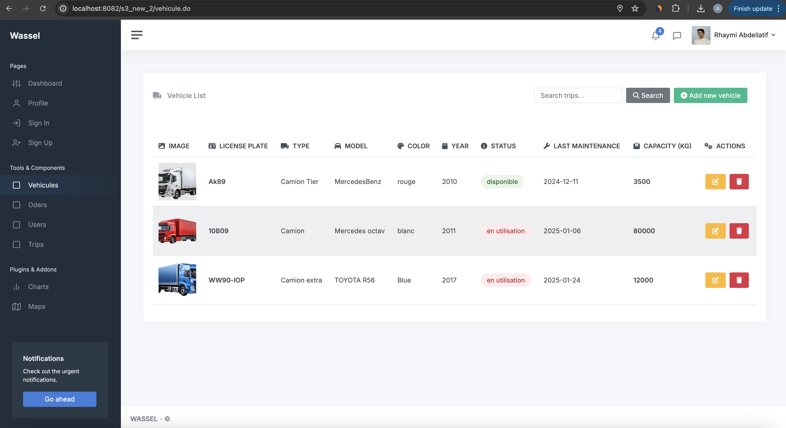
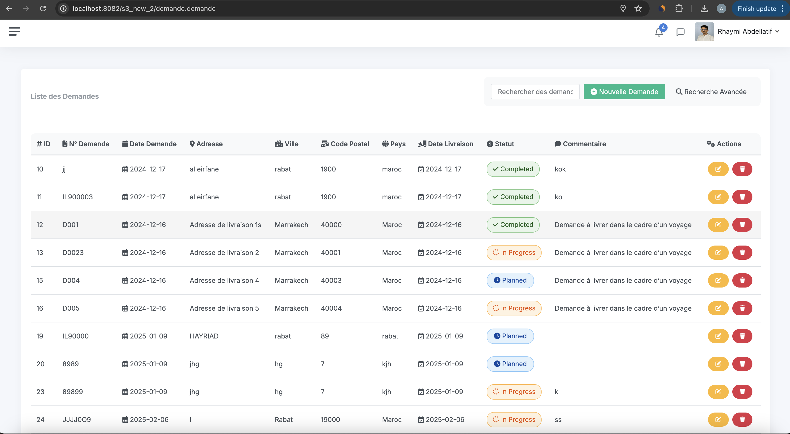
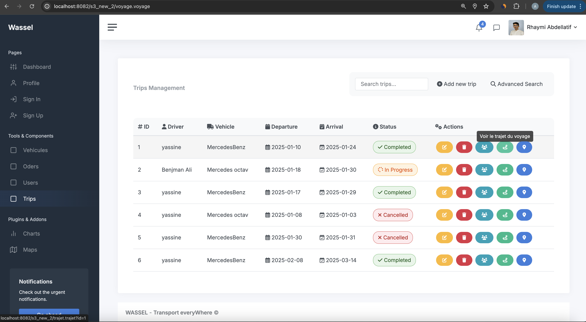
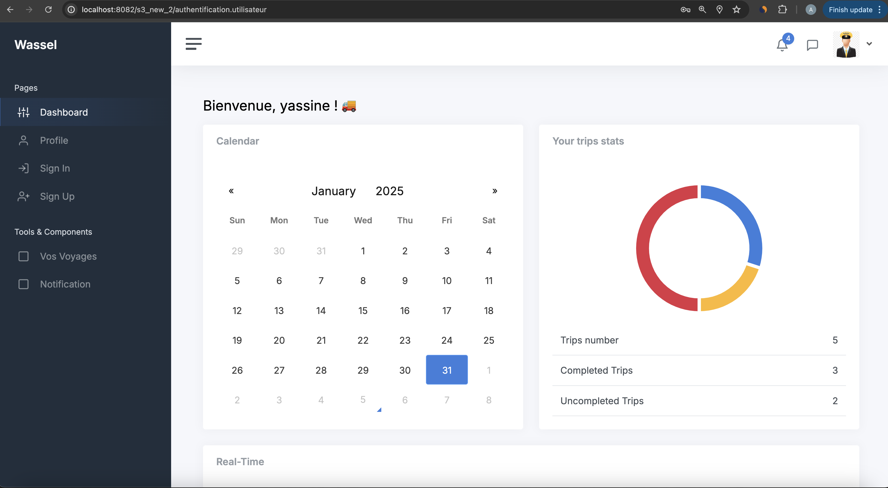

# 🚚 Wassel — Fleet & Transport Management System

Application web **full-stack (Java/J2EE)** de gestion intelligente du transport de fret : gestion de flotte, des demandes de livraison et des voyages, avec **optimisation d'itinéraires** et **suivi des chauffeurs en temps réel** sur carte.

---

## 🎯 Contexte

Une entreprise de transport doit coordonner ses **véhicules**, ses **chauffeurs**, les **demandes de livraison** et les **voyages** qui les regroupent — tout en optimisant les trajets pour réduire les délais et les coûts. **Wassel** centralise cette activité dans une application web : un back-office pour l'administrateur (flotte, demandes, voyages, statistiques), un espace dédié au chauffeur (ses voyages, sa position), et un site public de suivi d'expédition.

## ✨ Fonctionnalités

- 📊 **Tableau de bord analytique** : indicateurs clés (voyages, véhicules, colis, taux de livraison), calendrier et statuts en temps réel
- 🚛 **Gestion de flotte** : véhicules (immatriculation, type, capacité, maintenance, disponibilité)
- 📦 **Gestion des demandes** de livraison (adresses, dates, statuts, recherche avancée)
- 🗺️ **Gestion des voyages** : regroupement de demandes, affectation véhicule + chauffeur
- 🧭 **Optimisation d'itinéraire** via l'API **OpenRouteService** (distance et durée du trajet optimal)
- 📍 **Suivi en temps réel** de la position du chauffeur sur la carte
- 👥 **Rôles distincts** : administrateur et chauffeur (espaces séparés)
- 🔐 **Authentification** et gestion des utilisateurs

## 🏗️ Architecture

Application **MVC** en Java/J2EE. Les **Servlets** (contrôleurs) traitent les requêtes, la couche **DAO** dialogue avec **MySQL**, et l'optimisation d'itinéraire est déléguée à des **scripts Python** interrogeant l'API **OpenRouteService**.



- **Vue** : pages **JSP** (+ Bootstrap, Leaflet) — back-office, espace chauffeur et site public
- **Contrôleur** : **Servlets** (`ControleurServlet`, `DemandeServlet`, `VoyageServlet`, `TrajetVoyageservlet`, `UpdateLocationServlet`…)
- **Modèle** : entités (`Vehicule`, `Voyage`, `Trajet`, `Demande`, `Utilisateur`, `Location`) + couche **DAO** (interface + implémentation par entité)
- **Base de données** : **MySQL** (via `SingletonConnection` JDBC)

## ⭐ Fonctionnalités phares

### 🧭 Optimisation d'itinéraire

À partir des adresses des demandes regroupées dans un voyage, le système calcule le **trajet optimal** : le servlet transmet les coordonnées à un script Python (`route_optimizer.py`) qui interroge l'API **OpenRouteService**, récupère la **distance** et la **durée** du meilleur parcours, puis génère le **tracé sur la carte**. Le planificateur visualise ainsi l'itinéraire à suivre et son coût estimé.



### 📍 Suivi du chauffeur en temps réel

La position du chauffeur est **mise à jour en continu** (servlets `UpdateLocationServlet` / `GetLocationServlet`) et affichée en direct sur une carte **Leaflet**, superposée au trajet prévu. L'administrateur suit ainsi l'avancement réel de la livraison par rapport à l'itinéraire optimal.



## 🖼️ Interfaces par rôle

### 🌐 Site public & accès

| Site vitrine / suivi d'expédition | Connexion |
|:---:|:---:|
|  |  |

### 🛠️ Espace administrateur

| Tableau de bord analytique | Gestion de flotte |
|:---:|:---:|
|  |  |

| Demandes de livraison | Gestion des voyages |
|:---:|:---:|
|  |  |

### 🚚 Espace chauffeur

Le chauffeur dispose de son propre espace : ses voyages assignés, leur statut et son calendrier.



## 🛠️ Stack technique

| Domaine | Technologies |
|---|---|
| **Backend** | Java (Servlets, JSP), architecture MVC + DAO |
| **Base de données** | MySQL (JDBC) |
| **Frontend** | JSP · Bootstrap · JavaScript |
| **Cartographie / Itinéraires** | OpenRouteService API · Leaflet · Python (Folium) |
| **Serveur** | Apache Tomcat |

## 📁 Structure du projet

```
src/main/
├── java/
│   ├── entities/          # Modèle : Vehicule, Voyage, Trajet, Demande, Utilisateur, Location
│   ├── <Entity>Dao/       # Couche DAO (interface + implémentation) par entité
│   ├── web/               # Servlets (contrôleurs) + modèles web
│   └── SingletonConnection/  # Connexion JDBC MySQL
└── webapp/
    ├── *.jsp              # Vues (back-office + espace chauffeur + public)
    ├── route_optimizer.py # Optimisation d'itinéraire (OpenRouteService)
    ├── css/ js/ img/      # Ressources statiques
    └── WEB-INF/           # web.xml
```

## 🚀 Installation

```bash
git clone git@github.com:abdellatif-rhaymi/fleet-management-system.git
```
1. Créer une base MySQL nommée `transport` et configurer l'accès dans `SingletonConnection.java`.
2. Renseigner une **clé API OpenRouteService** (placeholder `YOUR_ORS_API_KEY` dans le code) — [openrouteservice.org](https://openrouteservice.org/).
3. Déployer sur **Apache Tomcat** (projet dynamique web) et lancer.
4. Prérequis Python (pour l'optimisation) : `pip install openrouteservice folium`.

## 👤 Auteur

**Abdellatif RHAYMI** — Ingénieur d'État en Informatique (ENSIAS)
[LinkedIn](https://www.linkedin.com/in/abdellatif-rhaymi/) · [GitHub](https://github.com/abdellatif-rhaymi)
